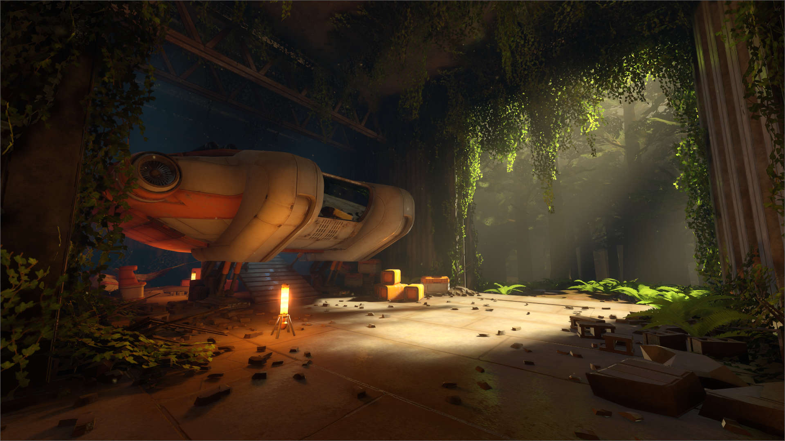
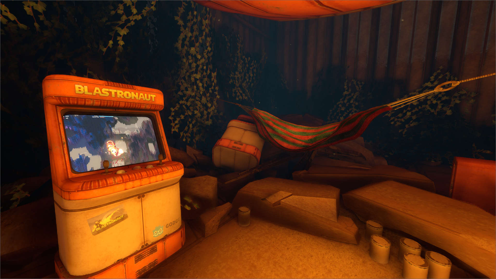
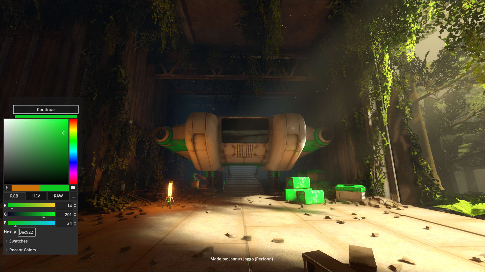

# Abandoned-Spaceship-Godot-Demo
Godot 4 demo scene of an abandoned spaceship in an overgrown hangar.

## How to install
1. Download the project
2. Open the project.godot with Godot 4.0
3. Run the Main.scene (default scene)
4. WASD to move, hold SHFIT for sprinting, ESC to open menu

## Features
1. Shows the light baking setup in Godot. Lightmaps are baked for Hangar and Outside scene separately.
2. Has trim sheet based materials with custom shader for color changing.
3. Has vertex color based terrain material for blending between different ground textures.
4. Animated in-world video display on the arcade machine.
5. Uses Godot Volumetric fog, SSIL, SSAO and Temporal antialiasing.
6. Uses reflection probes for the reflections.

## Additional Information
If you like my work, check out my game [BLASTRONAUT](https://store.steampowered.com/app/1392650/BLASTRONAUT/) as well.

## Included plugins and assets
[Simple Free-Look Camera](https://github.com/adamviola/simple-free-look-camera) by Adam Viola

Ground textures from [Polyhaven](https://polyhaven.com/textures) CC0